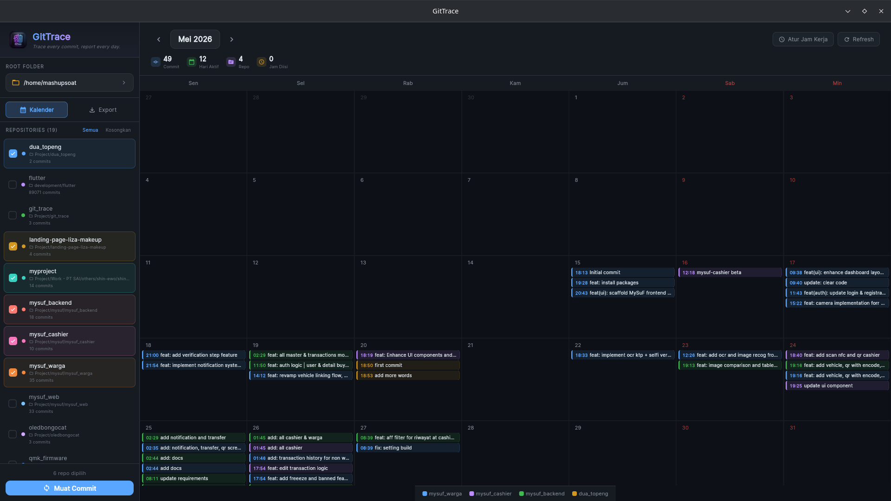
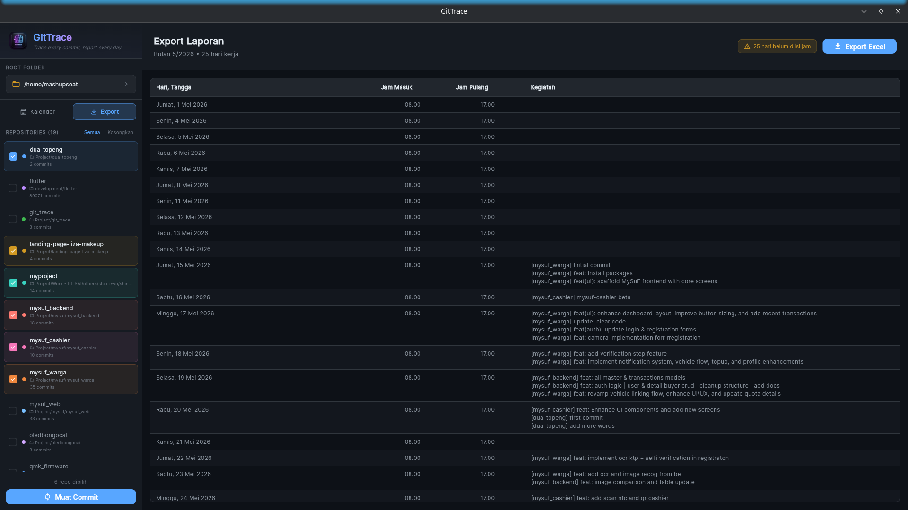
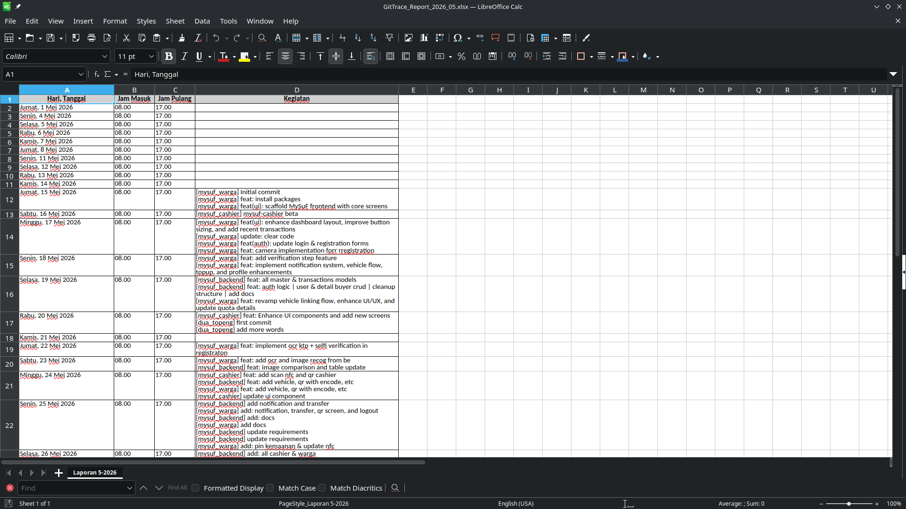

# GitTrace

> *"Trace every commit, report every day."*

**GitTrace** adalah aplikasi Flutter Desktop (Windows, macOS, Linux) yang dirancang khusus untuk mempermudah mahasiswa magang atau pekerja dalam membuat laporan bulanan berbasis aktivitas Git lokal. Aplikasi ini mendeteksi aktivitas Git Anda, memvisualisasikannya ke dalam kalender interaktif, dan menghasilkan laporan terformat secara otomatis.

---

## 🚀 Fitur Utama

### 1. Kalender Aktivitas Git (Dashboard Utama)
Aplikasi memindai repositori Git lokal Anda secara rekursif dan menyusun riwayat commit ke dalam kalender bulanan yang interaktif (mirip Google Calendar). Anda dapat melihat seberapa produktif hari-hari Anda dengan statistik commit harian, jumlah hari aktif, dan jumlah repositori yang berkontribusi.



* **Repository Scanner & Selector**: Pilih folder utama pekerjaan Anda, dan GitTrace akan mendeteksi seluruh repositori Git di dalamnya secara otomatis. Anda dapat memfilter repositori mana saja yang ingin disertakan dalam laporan melalui sidebar kiri.
* **Warna Repositori Khusus**: Setiap repositori mendapatkan penanda warna unik untuk membedakan aktivitas antar project dengan mudah di kalender.
* **Indikator Statistik**: Menampilkan jumlah total commit, hari aktif kerja, repositori terpilih, dan jam kerja yang telah diinput.

---

### 2. Pengaturan Jam Kerja (Working Hours)
Laporan magang umumnya memerlukan pencatatan jam masuk dan jam pulang. GitTrace memudahkan pengisian ini:
* **Pengaturan Jam Kerja Harian**: Cukup klik tanggal tertentu di kalender untuk menyesuaikan jam masuk dan jam pulang.
* **Bulk Set Jam Kerja**: Fitur pengisian sekaligus untuk rentang tanggal tertentu agar Anda tidak perlu mengisi satu per satu secara manual.

---

### 3. Pratinjau & Ekspor Laporan (Excel Dan Docx Export)
Sebelum berkas laporan diunduh, Anda dapat meninjau data dalam bentuk tabel pratinjau yang rapi. Format laporan yang dihasilkan telah disesuaikan dengan standar umum laporan magang.



* **Format Kolom Excel Terstandar**:
  * **Kolom A**: Hari, Tanggal (Format: `Senin, 13 Jan 2026`)
  * **Kolom B**: Jam Masuk (Format: `08.00`)
  * **Kolom C**: Jam Pulang (Format: `17.00`)
  * **Kolom D**: Kegiatan (Daftar pesan commit hari itu, dipisahkan per baris dan diawali dengan nama repositori, misal: `[repo-name] commit message`).
* **Auto-width & Text Wrap**: Lembar kerja Excel yang diunduh sudah otomatis menyesuaikan lebar kolom dan mengaktifkan bungkus teks (*text wrapping*) pada kolom Kegiatan agar rapi saat dicetak.



---

## 🛠️ Fitur yang Kurang & Rencana Pengembangan (Roadmap)

Berikut adalah beberapa fitur penting yang saat ini masih kurang dan sedang direncanakan untuk pengembangan selanjutnya:

### 1. Ekspor PDF / Word secara Dinamis
Saat ini ekspor baru mendukung format Excel (.xlsx). Di masa depan, diperlukan kemampuan untuk mengekspor langsung ke dokumen Word (.docx) atau PDF (.pdf) dengan ketentuan:
* **Formulir & Variabel Dinamis**: Form input untuk menyimpan data instansi/universitas seperti Nama Mahasiswa, NIM, Nama Pembimbing, Divisi/Bagian, Nama Perusahaan, dll.
* **Sintaks Templating**: Sistem template berkas Word menggunakan sintaks khusus (seperti `{{nama}}`, `{{nim}}`, `{{tabel_kegiatan}}`) untuk menyisipkan variabel dan tabel kegiatan secara otomatis ke dalam layout laporan yang sudah ditentukan oleh kampus/perusahaan.

### 2. Integrasi File Manager Pasca-Ekspor
Setelah proses ekspor selesai, sering kali pengguna kesulitan mencari lokasi berkasnya disimpan.
* **Solusi**: Penambahan tombol atau notifikasi interaktif **"Buka Folder"** atau **"Tampilkan di File Manager"** (Show in File Explorer/Finder) sesaat setelah ekspor berhasil, untuk membuka lokasi berkas secara instan.

### 3. Penanganan Commit Duplikat / Sama (Duplicate Commit Resolver)
Jika terdapat commit yang memiliki deskripsi pesan yang sama atau serupa pada hari yang sama (misalnya akibat aktivitas *rebase*, *cherry-pick*, atau commit yang tidak sengaja terduplikasi di repo berbeda):
* **Pilihan Penggabungan**: Aplikasi akan memberikan opsi kepada pengguna untuk:
  * **Gabung (Merge)**: Menyatukan pesan commit yang sama menjadi satu baris deskripsi kegiatan agar laporan lebih ringkas dan profesional.
  * **Pisah (Separate)**: Tetap membiarkan commit tertulis terpisah baris per baris.

---

## 💻 Cara Menjalankan Project

### Prasyarat
* Flutter SDK (`>=3.10.0`)
* Git CLI terinstal pada sistem operasi Anda

### Langkah-langkah
1. **Clone repositori ini**:
   ```bash
   git clone https://github.com/username/git_trace.git
   cd git_trace
   ```
2. **Unduh dependensi**:
   ```bash
   flutter pub get
   ```
3. **Jalankan aplikasi (Desktop)**:
   * **Windows**: `flutter run -d windows`
   * **macOS**: `flutter run -d macos`
   * **Linux**: `flutter run -d linux`
